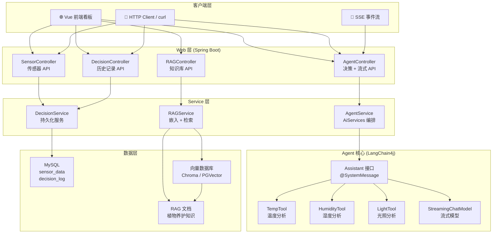
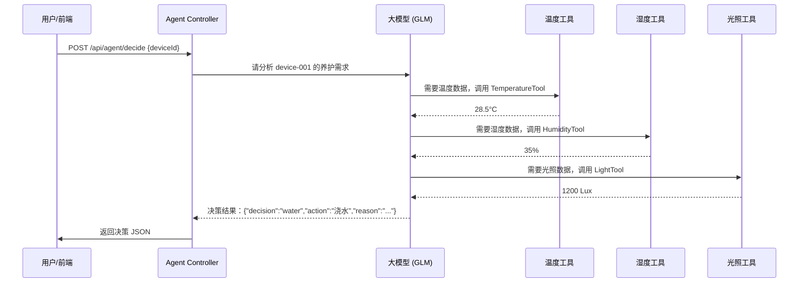
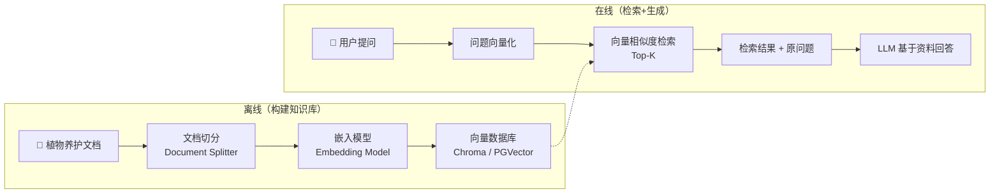

# 🌿 JAIoT — 智能养护 Agent 系统


> **J**ava **A**I + **IoT** = **JAIoT** 🦞
>
> 一个基于 **Spring Boot + LangChain4j + AI Agent** 的植物健康智能管理平台。
> 从零到一学习：Java 后端、AI Agent 开发、RAG 检索增强生成、流式通信。

---

## 📑 目录

1. [项目背景与学习目标](#1-项目背景与学习目标)
2. [六大核心功能](#2-六大核心功能)
3. [系统架构](#3-系统架构)
4. [技术栈全景](#4-技术栈全景)
5. [功能详解与知识点](#5-功能详解与知识点)
   - [5.1 传感器数据查看](#51-传感器数据查看)
   - [5.2 Agent 多工具决策](#52-agent-多工具决策浇水遮阳通风)
   - [5.3 流式输出（打字机效果）](#53-流式输出打字机效果)
   - [5.4 日语养护报告](#54-日语养护报告)
   - [5.5 RAG 知识库查询](#55-rag-知识库查询)
   - [5.6 历史决策记录](#56-历史决策记录)
6. [API 参考](#6-api-参考)
7. [快速启动](#7-快速启动)
8. [项目结构](#8-项目结构)
9. [面试要点](#9-面试要点)

---

## 1. 项目背景与学习目标

### 🎯 为什么做这个项目？

家庭/办公植物常因忘记浇水或不了解习性而枯萎。市面上的智能花盆只是数据展示，没有**智能决策**。JAIoT 的目标是：**让 AI Agent 像真正的植物学家一样，根据传感器数据自动判断养护动作**。

### 🧠 个人学习目标

| 目标 | 说明 |
|------|------|
| **Java 后端进阶** | Spring Boot 多模块、JPA、REST API 设计、SSE 流式通信 |
| **AI Agent 开发** | LangChain4j 框架、AiServices 动态代理、Function Calling |
| **RAG 实践** | 嵌入模型、向量检索、检索增强生成 |
| **大模型集成** | 对接智谱 GLM / DeepSeek / 通义千问（OpenAI 兼容 API） |
| **物联网概念** | MQTT 协议、传感器数据模拟 |
| **项目输出** | 一个完整的软硬结合项目，用于**杭州 Java 暑期实习求职** |

---

## 2. 六大核心功能

| # | 功能 | 一句话描述 | 学习重点 |
|---|------|-----------|---------|
| ① | 🌡️ **传感器数据查看** | 实时查看温度/湿度/光照数据及历史趋势 | JPA 持久化、REST API 分页查询、数据建模 |
| ② | 🤖 **Agent 多工具决策** | Agent 综合分析温湿度光照，自动决策浇水/遮阳/通风 | LangChain4j @Tool、多工具编排、Function Calling |
| ③ | ⚡ **流式输出** | 决策过程逐字输出，打字机效果 | SSE 协议、StreamingChatModel、响应式编程 |
| ④ | 🇯🇵 **日语养护报告** | Agent 同时输出中文决策和日语养护报告 | Prompt 工程、多语言输出结构化设计 |
| ⑤ | 📚 **RAG 知识库查询** | 基于本地养护文档，回答植物养护问题 | 嵌入模型、向量检索、检索增强生成 |
| ⑥ | 📋 **历史决策记录** | 查看所有历史决策，分析养护模式 | JPA 多表关联、数据可视化准备 |

---

## 3. 系统架构



---

## 4. 技术栈全景

| 层级 | 技术 | 版本 | 用途 |
|------|------|------|------|
| **框架** | Spring Boot | 3.3.5 | 应用容器 + IOC + REST |
| **构建** | Maven | 3.8+ | 依赖管理 + 多模块构建 |
| **AI 框架** | LangChain4j | 1.0.0 | AI Agent 编排（核心） |
| **大模型** | 智谱 GLM-4-Flash | - | 对话 + 工具调用（免费额度） |
| **数据库** | MySQL | 8.0 | 传感器数据 / 决策记录 |
| **ORM** | Spring Data JPA | - | 数据持久化 |
| **流式通信** | SSE (Server-Sent Events) | - | 打字机效果实时推送 |
| **向量数据库** | Chroma / PGVector | - | RAG 向量存储 |
| **嵌入模型** | text-embedding-3-small | - | 文本向量化 |
| **MQTT** | Eclipse Paho | - | IoT 传感器通信 |
| **Java** | JDK | 17 | 开发语言 |

---

## 5. 功能详解与知识点

---

### 5.1 传感器数据查看

#### 功能描述

模拟 IoT 传感器持续采集环境数据（温度、湿度、光照），提供 REST API 让前端查询最新数据、历史数据、按时间范围筛选。

#### 数据模型

```java
@Entity
@Table(name = "sensor_data")
public class SensorData {
    @Id
    @GeneratedValue(strategy = GenerationType.IDENTITY)
    private Long id;

    private String deviceId;      // 设备编号
    private Double temperature;   // 温度 (°C)
    private Double humidity;      // 湿度 (%)
    private Integer light;        // 光照强度 (Lux)
    private LocalDateTime createTime; // 采集时间
}
```

#### 🧠 知识点：Spring Data JPA

| 概念 | 解释 |
|------|------|
| `@Entity` | 标记为 JPA 实体，映射到数据库表 |
| `@Table` | 指定表名，默认是类名下划线格式 |
| `@Id` + `@GeneratedValue` | 主键自增策略 |
| `JpaRepository<T, ID>` | 内置 CRUD + 分页 + 排序 |
| `Pageable` | 分页查询，配合前端 antd table |
| `Specification` | 动态条件查询（时间范围、设备筛选） |

#### API 设计

```http
GET /api/sensor/latest/{deviceId}     → 最新一条
GET /api/sensor/history?deviceId=xxx&start=...&end=...&page=0&size=20
POST /api/sensor/data                 → 接收传感器上报
```

#### 模拟数据生产方式

用 Java `@Scheduled` 定时任务模拟 IoT 设备，每 30 秒生成一条随机数据写入数据库：

```java
@Component
public class SensorMockScheduler {
    @Scheduled(fixedRate = 30000)
    public void generateMockData() {
        SensorData data = new SensorData(
            "device-001",
            25 + (random.nextDouble() * 10 - 5),  // 20°C ~ 30°C
            60 + (random.nextDouble() * 30 - 15), // 45% ~ 75%
            800 + random.nextInt(1200)             // 800 ~ 2000 Lux
        );
        repository.save(data);
    }
}
```

> 💡 **学习要点**：`@Scheduled` + `@EnableScheduling` 实现定时任务，这是 Spring 中非常实用的企业级功能。

---

### 5.2 Agent 多工具决策（浇水/遮阳/通风）

#### 功能描述

Agent 不是一个简单的 if-else 判断器，而是 **通过大模型的理解能力 + 工具调用** 来做出像人一样的养护决策。

#### 决策流程



#### 🧠 知识点：LangChain4j Function Calling

这是本项目的**核心知识点**，面试常考。

**什么是 Function Calling？**

大模型本身没有"感知"能力，它不知道外界数据。Function Calling 让 LLM 在分析问题时可以**主动申请调用外部函数**，获取数据后再继续推理。

**LangChain4j 中的实现方式——@Tool 注解：**

```java
@Component
public class TemperatureTool {

    @Tool("查询指定设备的当前温度(°C)，返回温度数值")
    public double getTemperature(String deviceId) {
        SensorData data = sensorRepository.findLatestByDeviceId(deviceId);
        return data.getTemperature();
    }
}
```

**@Tool 的关键要素：**

| 要素 | 说明 | 为什么重要 |
|------|------|-----------|
| `@Tool("描述")` | 工具的描述文本 | **LLM 靠这个描述决定何时调用**。描述越清晰，LLM 越准确 |
| 方法参数 | 参数名 + 类型 | LLM 自动从对话中提取参数值 |
| 返回值 | 返回给 LLM 继续推理 | 返回值结构越清晰，LLM 理解越好 |

**三个工具的职责划分：**

| 工具名 | 查询内容 | 返回格式 | 用途 |
|--------|---------|---------|------|
| `TemperatureTool` | 设备当前温度 | `double` (°C) | 判断是否 > 30°C → 高温预警 |
| `HumidityTool` | 设备当前湿度 | `double` (%) | 判断是否 < 30% → 干旱 / > 80% → 过湿 |
| `LightTool` | 设备当前光照 | `int` (Lux) | 判断是否 < 500 → 缺光 / > 3000 → 暴晒 |

**Agent 的多工具编排决策规则（注入 Prompt）：**

```text
你是一个专业的植物养护专家。根据以下规则做出决策：

1. 温度 > 32°C → 建议「通风降温」
2. 光照 > 2500 Lux → 建议「遮阳」
3. 湿度 < 35% → 建议「浇水」
4. 温度 > 30°C 且 光照 > 2000 Lux → 建议「遮阳 + 通风」
5. 湿度 < 35% 且 温度 < 25°C → 建议「浇水」
6. 所有数值正常 → 建议「无需操作，状态良好」
```

> 💡 **学习要点**：多工具决策是 Agent 开发的核心能力。LLM 不是硬编码 if-else，而是**理解规则后自主决定调用哪些工具、按照什么顺序、如何组合结果**。这比传统规则引擎灵活得多。

---

### 5.3 流式输出（打字机效果）

#### 功能描述

当用户触发决策时，Agent 的思考过程（调用工具 → 获取数据 → 推理 → 生成报告）**逐字逐句**推送到前端，实现"打字机"效果。用户体验大幅提升，不再需要等十几秒才拿到完整结果。

#### 什么是 SSE？

SSE = **Server-Sent Events**（服务器推送事件）。和 WebSocket 不同，SSE 是**单向**的（服务器 → 客户端），基于 HTTP 长连接，浏览器原生支持。

```
HTTP Response Header:
Content-Type: text/event-stream
Cache-Control: no-cache
Connection: keep-alive

data: {"type": "tool_call", "tool": "温度工具", "result": "28.5°C"}

data: {"type": "tool_call", "tool": "湿度工具", "result": "35%"}

data: {"type": "decision", "decision": "浇水", "reason": "土壤湿度仅为35%..."}

data: {"type": "complete"}
```

#### 🧠 知识点：StreamingChatModel vs ChatModel

| 对比 | ChatModel | StreamingChatModel |
|------|-----------|-------------------|
| 返回方式 | 一次性返回完整字符串 | 通过 `TokenStream` 流式逐 token 返回 |
| 延迟感知 | 等待全部生成才能看到 | 边生成边看到，首 token 延迟极低 |
| 适合场景 | 简短问答、工具调用 | 长文本生成、养护报告、打字机效果 |
| 实现难度 | 简单 | 中等（需 SSE 配合） |

**核心代码模式：**

```java
// 1. 在 AgentAssistant 接口中定义流式方法
public interface Assistant {
    TokenStream streamDecide(String deviceId);
}

// 2. 构建时绑定流式模型
this.assistant = AiServices.builder(Assistant.class)
    .chatModel(model)              // 普通模型
    .streamingChatModel(streamingModel)  // 流式模型
    .tools(tool1, tool2, tool3)
    .build();

// 3. Controller 中用 SSE 返回
@GetMapping(value = "/api/agent/stream-decision", produces = MediaType.TEXT_EVENT_STREAM_VALUE)
public SseEmitter streamDecision(@RequestParam String deviceId) {
    SseEmitter emitter = new SseEmitter(60_000L); // 60 秒超时
    
    TokenStream tokenStream = assistant.streamDecide(deviceId);
    tokenStream
        .onNext(token -> emitter.send(SseEmitter.event().data(token)))
        .onComplete(response -> emitter.complete())
        .onError(error -> emitter.completeWithError(error))
        .start();
    
    return emitter;
}
```

> 💡 **学习要点**：SSE + StreamingChatModel 是 AI 应用开发的**标准实践**，几乎所有 AI 产品（ChatGPT、Claude、通义千问）都使用流式输出。掌握它意味着你理解了现代 AI 应用的前后端通信模式。

---

### 5.4 日语养护报告

#### 功能描述

Agent 不仅在决策结果中包含中文分析，还**同时生成一份日语养护报告**，适合输出给日本用户或用于日语学习。

#### 输出格式

```json
{
  "decision": "浇水",
  "reason": "当前土壤湿度为28%，低于植物生长所需的最低水分阈值。建议立即均匀浇透水，直至盆底有水渗出。",
  "japaneseReport": {
    "plantStatus": "植物の状態：現在の土壌湿度は28%で、やや乾燥しています。",
    "advice": "アドバイス：すぐに水をたっぷり与えてください。",
    "warning": "注意事項：水やり後は受け皿の水を捨てて、根腐れを防ぎましょう。",
    "summary": "まとめ：本日は水やりが必要です。"
  }
}
```

#### 🧠 知识点：Prompt 工程（结构化输出）

让大模型输出多语言内容，关键是 **Prompt 指令要结构化**：

```java
@SystemMessage("""
    你是一个植物养护专家。根据工具获取的传感器数据，完成以下任务：
    
    任务 1：用中文给出养护决策（decision + reason）
    任务 2：用日语写出养护报告，包含以下部分：
      - plantStatus：植物当前状态描述
      - advice：具体养护建议
      - warning：注意事项
      - summary：一句话总结
    
    请以 JSON 格式输出：
    {
      "decision": "...",
      "reason": "...",
      "japaneseReport": {
        "plantStatus": "...",
        "advice": "...",
        "warning": "...",
        "summary": "..."
      }
    }
    """)
```

**Prompt 工程的核心原则：**

| 原则 | 说明 |
|------|------|
| **任务分解** | 把一个大任务拆成多个子任务，LLM 更容易理解 |
| **输出格式化** | 明确告诉 LLM 输出格式（JSON schema），避免解析错误 |
| **示例驱动** | 给出少量示例（Few-shot），效果远好于纯描述 |
| **角色设定** | 给 LLM 一个身份（植物学家），输出质量更高 |

> 💡 **学习要点**：Prompt 工程是 AI 应用开发中**最被低估的技能**。同样的模型，好的 prompt 和差的 prompt 输出质量天差地别。这是面试中可以展示的"软实力"。

---

### 5.5 RAG 知识库查询

#### 功能描述

RAG = **Retrieval-Augmented Generation**（检索增强生成）。简单说：**让 Agent 在回答前先去"查资料"，而不是只靠自己的知识**。

传统 LLM 的局限：训练数据有截止日期，不了解你的特定文档。
RAG 的解决方案：先把文档切碎→向量化→存起来，用户提问时检索相关片段→注入到 Prompt→让 LLM 基于这些片段回答。

#### 工作流程



#### 🧠 知识点：RAG 的四个关键步骤

**Step 1：文档加载与切分**

```java
// 从 resources 目录加载养护知识文档
DocumentParser parser = new TextDocumentParser();
Document document = DocumentParser.parse(
    new FileInputStream("classpath:rag/plant-care-knowledge.txt")
);

// 切分成 500 token 的块，块之间重叠 50 token
DocumentSplitter splitter = DocumentSplitter.recursive(
    500, 50  // chunkSize, overlap
);
List<TextSegment> segments = splitter.split(document);
```

**Step 2：向量化（Embedding）**

```java
// 嵌入模型：将文本转为向量（一串数字）
EmbeddingModel embeddingModel = new OpenAiEmbeddingModel(
    OpenAiEmbeddingModelName.TEXT_EMBEDDING_3_SMALL
);

// "浇水" → [0.125, -0.034, 0.678, ...]  // 1536 维向量
Embedding embedding = embeddingModel.embed("浇水").content();
```

**Step 3：向量存储**

```java
// 使用内存向量存储（ChromaLangChain4j 或 EmbeddedInMemoryStore）
EmbeddingStore<TextSegment> store = new InMemoryEmbeddingStore<>();
store.addAll(segments, embeddingModel.embedAll(segments).content());
```

**Step 4：检索增强生成**

```java
// 创建检索器
ContentRetriever retriever = EmbeddingStoreContentRetriever.builder()
    .embeddingStore(store)
    .embeddingModel(embeddingModel)
    .maxResults(3)           // 检索最相似的 3 段
    .minScore(0.6)           // 相似度阈值
    .build();

// 组装 RAG Agent
Assistant assistant = AiServices.builder(Assistant.class)
    .chatModel(model)
    .contentRetriever(retriever)  // ← RAG 的关键一行
    .tools(tempTool, humidTool, lightTool)
    .build();
```

**RAG 的核心价值：**

| 问题 | 无 RAG | 有 RAG |
|------|--------|--------|
| "多肉植物多久浇一次水？" | 靠训练数据中的通用知识 | 检索你的养护手册→给出针对你植物的具体建议 |
| "我的绿萝叶子发黄怎么办？" | 泛泛而谈 | 检索病害对照表→精确定位问题 |
| 知识更新 | 需重新训练/微调模型 | **更新文档即可**，零成本 |

> 💡 **学习要点**：RAG 是目前企业级 AI 应用**最主流的技术方案**。它解决了大模型"胡说八道"和"知识陈旧"两大痛点。面试中如果说你做过 RAG，面试官会非常感兴趣。

---

### 5.6 历史决策记录

#### 功能描述

每次 Agent 决策后，将完整的决策过程持久化到数据库，提供 API 查询历史记录、按设备/时间筛选、统计养护趋势。

#### 数据模型

```java
@Entity
@Table(name = "decision_log")
public class DecisionLog {
    @Id
    @GeneratedValue(strategy = GenerationType.IDENTITY)
    private Long id;

    private String deviceId;          // 设备编号
    private String decision;          // 决策：water / shade / ventilate / noop
    private String reason;            // 决策理由（中文）
    @Column(columnDefinition = "TEXT")
    private String japaneseReport;    // 日语报告（JSON 字符串）
    private Double temperature;       // 决策时的温度
    private Double humidity;          // 决策时的湿度
    private Integer light;            // 决策时的光照
    private LocalDateTime createTime; // 决策时间
}
```

#### 🧠 知识点：JPA 复杂查询

```java
public interface DecisionLogRepository extends JpaRepository<DecisionLog, Long> {

    // 按设备查询，按时间倒序
    Page<DecisionLog> findByDeviceIdOrderByCreateTimeDesc(
        String deviceId, Pageable pageable);

    // 时间范围查询
    @Query("SELECT d FROM DecisionLog d WHERE d.deviceId = :deviceId " +
           "AND d.createTime BETWEEN :start AND :end ORDER BY d.createTime DESC")
    Page<DecisionLog> findByDeviceIdAndTimeRange(
        @Param("deviceId") String deviceId,
        @Param("start") LocalDateTime start,
        @Param("end") LocalDateTime end,
        Pageable pageable);

    // 统计各决策类型出现的次数
    @Query("SELECT d.decision, COUNT(d) FROM DecisionLog d " +
           "GROUP BY d.decision")
    List<Object[]> countByDecision();
}
```

**为什么需要持久化？**

| 用途 | 说明 |
|------|------|
| **追溯** | 查看何时、因何原因触发了某个养护动作 |
| **分析** | 统计浇水频率、高温预警次数，优化养护策略 |
| **调试** | Agent 决策错误时，可以回看当时的传感器数据和 LLM 输出 |
| **展示** | 前端图表展示养护趋势（面试时可视化更出彩） |

> 💡 **学习要点**：历史记录是任何企业级应用的基础功能。面试中展示"我不仅做了功能，还考虑了数据持久化和可追溯性"，说明你有工程思维。

---

## 6. API 参考

### 传感器 API

| 方法 | 路径 | 说明 |
|------|------|------|
| `GET` | `/api/sensor/latest/{deviceId}` | 获取某设备最新传感器数据 |
| `GET` | `/api/sensor/history` | 获取历史数据（支持 page, size, start, end, deviceId） |
| `POST` | `/api/sensor/data` | 接收传感器上报数据（或由 MQTT 消费） |

### Agent 决策 API

| 方法 | 路径 | 说明 |
|------|------|------|
| `POST` | `/api/agent/decide` | 触发完整决策，返回 JSON |
| `GET` | `/api/agent/stream-decision?deviceId=xxx` | 流式决策过程（SSE，打字机效果） |
| `GET` | `/api/agent/decisions?deviceId=xxx` | 查询历史决策记录 |
| `GET` | `/api/agent/decisions/stats?deviceId=xxx` | 决策统计（各类型次数） |

### RAG 知识库 API

| 方法 | 路径 | 说明 |
|------|------|------|
| `POST` | `/api/rag/ask` | 基于知识库提问，返回 LLM 回答 |
| `POST` | `/api/rag/upload` | 上传养护文档到知识库 |
| `GET` | `/api/rag/documents` | 列出已导入的文档列表 |

---

## 7. 快速启动

### 环境要求

- JDK 17+
- Maven 3.8+
- MySQL 8.0+（可选，默认使用 H2 内存数据库开发）
- 智谱 GLM API Key（[免费申请](https://open.bigmodel.cn/)）

### 启动步骤

```bash
# 1. 克隆项目
git clone https://github.com/your-username/jaiot-project.git
cd jaiot-project

# 2. 设置 API Key
export ZHIPU_API_KEY="你的智谱API密钥"

# 3. 启动（使用 H2 内存数据库，无需安装 MySQL）
mvn spring-boot:run

# 4. 测试健康检查
curl http://localhost:8080/health

# 5. 测试 Agent 决策
curl -X POST http://localhost:8080/api/agent/decide \
  -H "Content-Type: application/json" \
  -d '{"deviceId": "device-001"}'
```

### 配置文件

```yaml
# application.yml 关键配置项
server:
  port: 8080

spring:
  datasource:
    url: jdbc:h2:mem:jaiot           # 开发用 H2 内存库
    # url: jdbc:mysql://localhost:3306/jaiot  # 生产用 MySQL
  jpa:
    hibernate:
      ddl-auto: update                # 自动建表

zhipu:
  api-key: ${ZHIPU_API_KEY}
  model: glm-4-flash
```

---

## 8. 项目结构

```
jaiot-project/
├── pom.xml                           # Maven 父模块
├── README.md                         # 📄 本文件
│
├── src/main/java/com/jaiot/
│   ├── JaiotApplication.java         # 启动类
│   ├── config/                       # 配置类
│   │   ├── MqttConfig.java           # MQTT 配置
│   │   ├── ChatModelConfig.java      # 大模型 + 流式模型配置
│   │   └── SseConfig.java            # SSE 配置
│   ├── controller/                    # REST API
│   │   ├── SensorController.java     # 传感器 API
│   │   ├── AgentController.java      # Agent 决策 API
│   │   ├── RagController.java        # RAG 知识库 API
│   │   └── DecisionController.java   # 历史决策 API
│   ├── service/                      # 业务逻辑
│   │   ├── SensorService.java        # 传感器数据服务
│   │   ├── AgentService.java         # Agent 决策服务
│   │   ├── RagService.java           # RAG 检索服务
│   │   └── DecisionService.java      # 决策持久化服务
│   ├── agent/                        # Agent 核心
│   │   ├── AgentAssistant.java       # Assistant 接口 (@SystemMessage)
│   │   ├── TemperatureTool.java      # @Tool 温度工具
│   │   ├── HumidityTool.java         # @Tool 湿度工具
│   │   └── LightTool.java            # @Tool 光照工具
│   ├── entity/                       # JPA 实体
│   │   ├── SensorData.java           # 传感器数据实体
│   │   └── DecisionLog.java          # 决策日志实体
│   ├── repository/                   # JPA Repository
│   │   ├── SensorDataRepository.java
│   │   └── DecisionLogRepository.java
│   ├── dto/                          # 数据传输对象
│   │   ├── SensorDataDto.java
│   │   ├── DecisionRequest.java
│   │   └── DecisionResponse.java
│   └── scheduler/                    # 定时任务
│       └── SensorMockScheduler.java  # 模拟传感器数据
│
├── src/main/resources/
│   ├── application.yml               # 主配置
│   ├── application-dev.yml           # 开发环境配置
│   └── rag/                          # RAG 知识文档
│       └── plant-care-knowledge.txt  # 植物养护知识库
│
└── src/test/java/com/jaiot/
    └── ...                           # 单元测试
```

---

## 9. 面试要点

### 这个项目面试时可以怎么说？

**自我介绍（30 秒版）：**
> "我做了个基于 Spring Boot + LangChain4j 的智能植物养护系统。它通过 AI Agent 分析传感器数据，自动决策浇水、遮阳、通风等养护动作。还支持流式输出的打字机效果、日语报告和 RAG 知识库查询。"

**核心技术点（面试官可能追问）：**

| 问 | 答 |
|---|----|
| LangChain4j 的 AiServices 原理？ | 动态代理工厂，在运行时生成接口实现类，拦截方法调用后与 LLM 交互，处理 @SystemMessage、@Tool、@MemoryId 等注解 |
| Function Calling 怎么实现的？ | LLM 返回 tool_call 请求 → LangChain4j 解析 → 调用 @Tool 方法 → 结果回传给 LLM 继续推理 |
| RAG 和直接问 LLM 有什么区别？ | RAG 先检索相关文档片段，注入到 Prompt 中，让 LLM 基于检索到的资料回答，避免幻觉且知识可更新 |
| 流式输出怎么做的？ | 使用 StreamingChatModel + SSE（Server-Sent Events），token 逐字通过事件流推送到前端 |
| 为什么用 SSE 而不是 WebSocket？ | SSE 是浏览器原生支持的单向推送，足够 AI 流式输出场景使用，比 WebSocket 轻量得多 |

### 简历上怎么写？

```
JAIoT 智能养护 Agent 系统
技术栈：Java 17 / Spring Boot 3 / LangChain4j / MySQL / SSE / RAG

- 基于 Spring Boot 3 + LangChain4j 构建 AI Agent 系统，实现多工具决策
- 集成 SSE 流式输出，实现 AI 决策过程实时展示（打字机效果）
- 设计 RAG 知识库方案，使 Agent 能基于本地养护文档回答问题
- 使用 JPA + MySQL 持久化传感器数据和决策日志，支持历史查询
- 编写多语言 Prompt 工程，支持中文决策 + 日语养护报告双输出
```

---

## 📚 推荐学习路径

1. **先跑通** → `mvn spring-boot:run` 看 Agent 能正常返回决策
2. **改工具** → 修改 `SensorTool` 返回自己的模拟数据范围
3. **改 Prompt** → 调整 `@SystemMessage` 试试不同的决策规则
4. **加新工具** → 自己实现一个新的 `@Tool`（比如天气预报工具）
5. **加数据库** → 从 H2 切换到 MySQL，看完整的 CRUD 流程
6. **加流式** → 添加 `StreamingChatModel`，体验打字机效果
7. **加 RAG** → 创建知识文档，体验检索增强生成
8. **加前端** → 用 Vue 做个看板展示数据（下一阶段）

---

> 🦞 **虾哥说**：这个项目从零到完整功能，涵盖了 Java 后端开发的方方面面。不仅能帮你拿到实习 offer，还能让你真正理解现代 AI 应用是怎么搭起来的。有问题随时问，虾哥 24h 在线（虽然是个龙虾，但我不需要睡觉）。

---

*JAIoT — Java AI + IoT = 智能养护 🪴*
