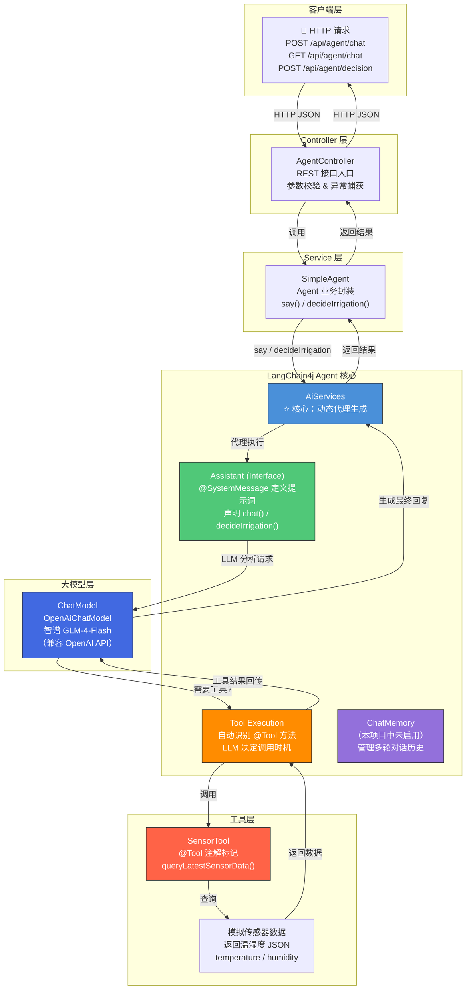
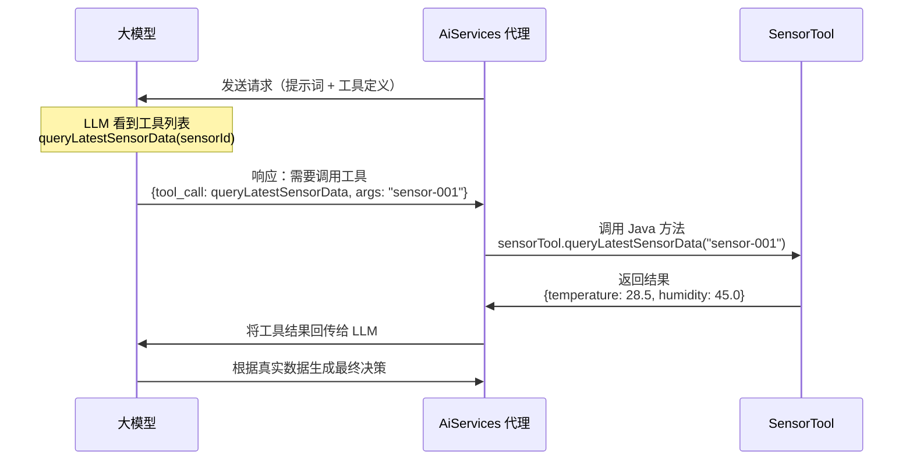
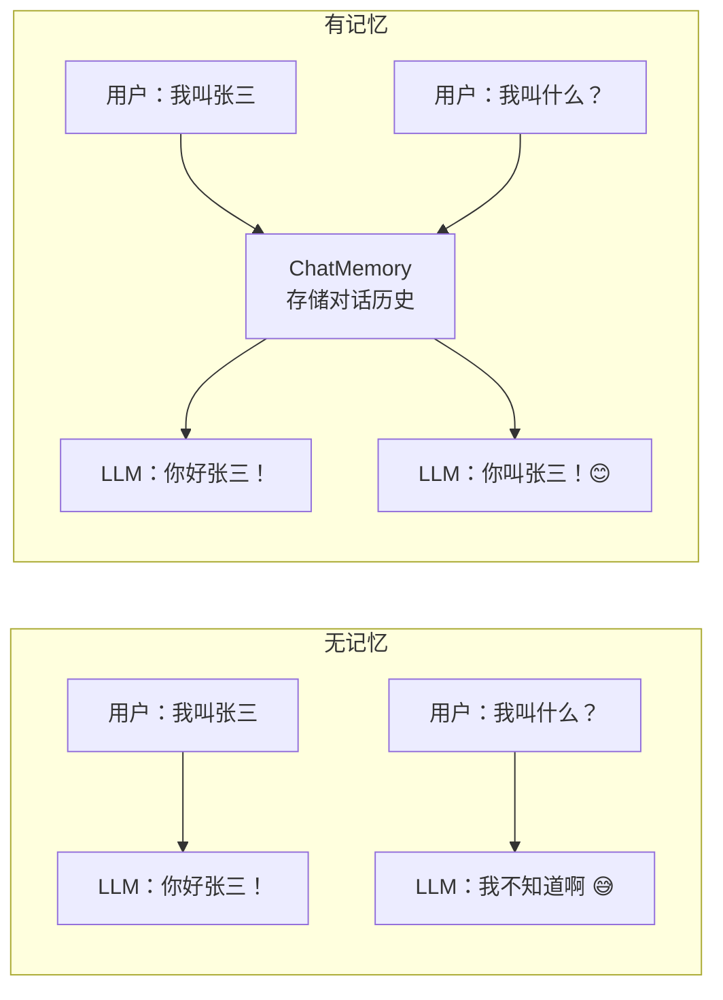
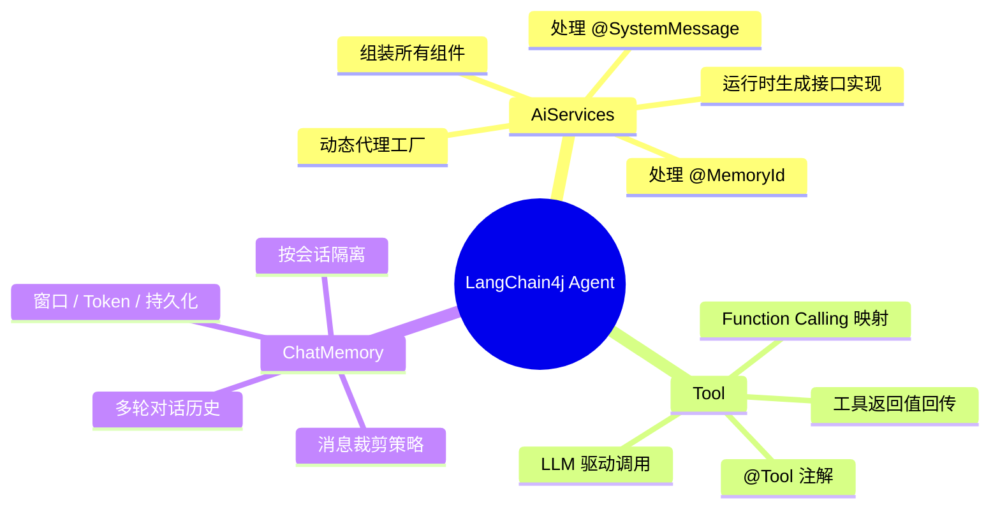

# 虾哥 Agent 🦞 — LangChain4j Agent 演示项目

基于 **Spring Boot 3.3.5 + LangChain4j 1.0.0** 的智能 Agent 演示，对接智谱 GLM-4 大模型，实现**智能灌溉决策**场景。

---

## 一、整体调用流程图



---

## 二、调用流程分步解析

以一个 `POST /api/agent/decision` 请求为例，完整流程如下：

| 步骤 | 角色 | 做了什么 |
|------|------|----------|
| ① | **AgentController** | 接收 HTTP 请求，提取 sensorId，调用 `simpleAgent.decideIrrigation(sensorId)` |
| ② | **SimpleAgent** | 调用 `assistant.decideIrrigation(sensorId)` — 这个 `assistant` 是 AiServices 动态生成的代理对象 |
| ③ | **AiServices 代理** | 拦截方法调用，读取 `@SystemMessage` 提示词 + 用户输入，构造 LLM 请求 |
| ④ | **ChatModel** | 将请求发往智谱 GLM-4 API，LLM 分析后发现需要传感器数据，返回工具调用请求 |
| ⑤ | **Tool Execution** | LangChain4j 自动解析 LLM 返回的 tool_call，执   行 `SensorTool.queryLatestSensorData()` |
| ⑥ | **SensorTool** | 返回模拟的温湿度数据（如 `{temperature: 28.5, humidity: 45.0}`） |
| ⑦ | **Tool Execution** | 将工具结果回传给 LLM，让 LLM 基于真实数据继续推理 |
| ⑧ | **ChatModel** | LLM 根据温湿度数据做出灌溉决策，返回 JSON 格式结果 |
| ⑨ | **AiServices 代理** | 将 LLM 返回的文本作为 `decideIrrigation()` 的返回值传出 |
| ⑩ | **SimpleAgent** | 返回 JSON 字符串给 Controller |
| ⑪ | **AgentController** | 用 Jackson 解析 JSON 为 `DecisionResponse` 对象，返回给客户端 |

---

## 三、三大核心类深度解析

### 3.1 ⭐ AiServices — Agent 的"大脑皮层"

#### 是什么？

`AiServices` 是 LangChain4j 中最核心的类，它是一个**动态代理工厂**，负责将 Java 接口 + 大模型 + 工具 + 记忆 组装成一个可运行的 AI Agent。

#### 工作原理

```java
// 你定义一个纯 Java 接口
public interface Assistant {
    String chat(String userMessage);
    String decideIrrigation(String sensorId);
}

// AiServices 在运行时动态生成接口的实现类
this.assistant = AiServices.<Assistant>builder(Assistant.class)
        .chatModel(model)        // 绑定大模型
        .tools(sensorTool)       // 绑定工具
        // .chatMemory(memory)   // 可选：绑定对话记忆
        .build();
```

当调用 `assistant.chat("你好")` 时，AiServices 生成的代理对象会：

1. 读取 `chat()` 方法上的 `@SystemMessage` 注解 → 得到系统提示词
2. 将系统提示词 + 用户消息组合 → 发给 `ChatModel`
3. 拿到 LLM 返回 → 交还给调用方

#### 类比理解

| 概念 | 类比 | 说明 |
|------|------|------|
| `AiServices` | **经纪人** | 帮你找大模型（演员）、配工具（道具）、管理记忆（剧本） |
| `Assistant` 接口 | **合同** | 定义了 Agent 能做什么（方法签名） |
| `@SystemMessage` | **角色设定** | 告诉 LLM 它是谁、该怎么说话、按什么规则做事 |

#### 核心 API 一览

```java
// 基础构建
AiServices.builder(Assistant.class)
    .chatModel(model)         // 注入 ChatModel（必填）
    .streamingChatModel(...)  // 注入流式模型（可选）
    .tools(bean)              // 注入工具 Bean（可选）
    .chatMemory(memory)       // 注入对话记忆（可选）
    .build();                 // 生成代理实例
```

---

### 3.2 🛠️ Tool（@Tool 注解）— Agent 的"手和脚"

#### 是什么？

`@Tool` 注解标记在 Java 方法上，告诉 LangChain4j：**这个方法可以被 LLM 主动调用**。这是大模型 **Function Calling（函数调用）** 能力在 Java 端的映射。

#### 工作流程



#### 在本项目中的应用

```java
@Component
public class SensorTool {

    @Tool("查询指定传感器的最近温湿度数据")
    public String queryLatestSensorData(String sensorId) {
        // 返回模拟数据
        SensorData data = new SensorData(sensorId, 28.5, 45.0);
        return objectMapper.writeValueAsString(data);
    }
}
```

关键点：

- `@Tool("描述")` — 描述**非常重要**！LLM 根据这个描述判断何时调用该工具
- 方法参数 — LLM 会自动提取参数值（从对话上下文中推理）
- 返回值 — 会被回传给 LLM，继续推理

#### @Tool 注解的最佳实践

| 实践 | 说明 |
|------|------|
| 描述要清晰 | `@Tool("根据用户ID查询用户信息")` 比 `@Tool("查询")` 好得多 |
| 参数名要有意义 | LLM 通过参数名理解需要传什么值 |
| 返回值要结构化 | 返回 JSON 字符串比返回自由文本更利于 LLM 解析 |
| 工具要原子化 | 一个工具只做一件事，方便 LLM 组合使用 |

---

### 3.3 🧠 ChatMemory — Agent 的"记忆"

#### 是什么？

`ChatMemory` 管理 Agent 的**多轮对话历史**，让 LLM 能"记住"之前说过的话。没有记忆的 Agent 每次对话都是"失忆"的，就像《海底总动员》的多莉 🐠。

本项目**当前未启用 ChatMemory**，所以每次对话都是独立的。如果启用，流程会变成：



#### ChatMemory 的几种实现

```java
// 1. 没有记忆（默认）— 每次对话独立
// 不传 chatMemory 即可

// 2. 窗口记忆 — 只保留最近 N 条消息
ChatMemory window = MessageWindowChatMemory.builder()
        .maxMessages(10)        // 记住最近 10 条
        .build();

// 3. 令牌窗口记忆 — 按 Token 数裁剪
ChatMemory tokenWindow = TokenWindowChatMemory.builder()
        .maxTokens(2000)        // 最多保留 2000 token
        .build();

// 4. 持久化记忆 — 存到数据库
ChatMemory persistent = PersistentChatMemory.builder()
        .chatStore(databaseChatStore)
        .build();
```

#### 在 SimpleAgent 中启用记忆

```java
// 1. 在 SimpleAgent 中创建 ChatMemory
private static final ChatMemory chatMemory = MessageWindowChatMemory.builder()
        .maxMessages(20)
        .build();

// 2. 绑定到 AiServices
this.assistant = AiServices.<Assistant>builder(Assistant.class)
        .chatModel(model)
        .chatMemory(chatMemory)     // ← 加入这行
        .tools(sensorTool)
        .build();
```

启用后，`Assistant` 接口的方法需要接收 `@MemoryId` 参数来区分不同会话：

```java
public interface Assistant {
    String chat(@MemoryId Long sessionId, String userMessage);
}
```

---

## 四、三大核心类的关系总结



| 维度 | AiServices | Tool | ChatMemory |
|------|-----------|------|------------|
| **角色** | 编排者（Orchestrator） | 执行者（Executor） | 记忆体（Memory） |
| **类比** | 经纪人 + 导演 | 工具包 / 道具箱 | 笔记本 |
| **核心价值** | 将接口 + LLM + 工具 + 记忆 无缝集成 | 让 LLM 能调用外部系统 | 让 LLM 记住上下文 |
| **配置方式** | builder 模式 | `@Tool` 注解 | builder 模式 |
| **是否必选** | ✅ 是 | ❌ 否 | ❌ 否 |
| **本项目中** | 生成 Assistant 代理 | 模拟查询传感器数据 | 未使用 |

---

## 五、启动 & 测试

### 环境要求

- JDK 17+
- Maven 3.8+

### 启动

```bash
# 1. 设置智谱 API Key
export ZHIPU_API_KEY="你的智谱API密钥"   # Linux / macOS
set ZHIPU_API_KEY="你的智谱API密钥"      # Windows CMD
$env:ZHIPU_API_KEY="你的智谱API密钥"     # Windows PowerShell

# 2. 启动（REST 模式）
mvn spring-boot:run

# 3. 或启动 CLI 交互模式
mvn spring-boot:run "-Dspring-boot.run.arguments=--agent.cli=true"
```

### 测试 API

```bash
# 对话
curl -X POST http://localhost:8081/api/agent/chat \
  -H "Content-Type: application/json" \
  -d '{"message": "你好，你是谁？"}'

# 灌溉决策
curl -X POST http://localhost:8081/api/agent/decision \
  -H "Content-Type: application/json" \
  -d '{"sensorId": "sensor-001"}'
```

---

## 六、项目结构

```
agent-demo/
├── pom.xml                          # Maven 构建配置
├── src/
│   ├── main/
│   │   ├── java/com/jaiot/agent/
│   │   │   ├── AgentApplication.java    # Spring Boot 入口 + ChatModel Bean
│   │   │   ├── AgentController.java     # REST API 控制器
│   │   │   ├── AgentCliRunner.java      # CLI 交互模式
│   │   │   ├── SimpleAgent.java         # Agent 核心（AiServices + Assistant）
│   │   │   ├── SensorTool.java          # @Tool 工具定义
│   │   │   ├── SensorData.java          # 传感器数据模型
│   │   │   └── DecisionResponse.java    # 决策响应模型
│   │   └── resources/
│   │       └── application.yml          # 配置文件
│   └── test/java/com/jaiot/agent/
│       └── SimpleAgentTest.java         # 单元测试
└── README.md
```

---

## 七、进阶学习方向

1. **多工具组合**：注册多个 `@Tool`，让 LLM 像搭积木一样组合使用
2. **流式响应**：用 `streamingChatModel()` 实现打字机效果
3. **持久化记忆**：用 Redis / 数据库存储 ChatMemory，支持跨会话记忆
4. **多 Agent 协作**：多个 AiServices 实例分工协作
5. **图像 / 多模态**：LangChain4j 支持图像输入
6. **RAG（检索增强生成）**：结合向量数据库，让 Agent 能查阅知识库
